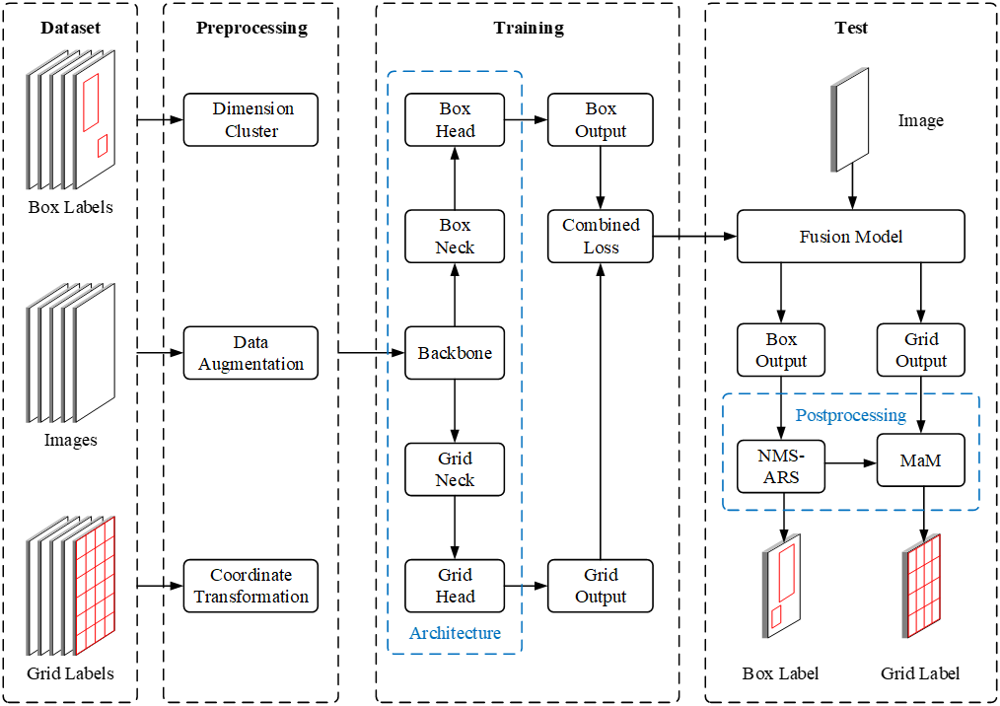
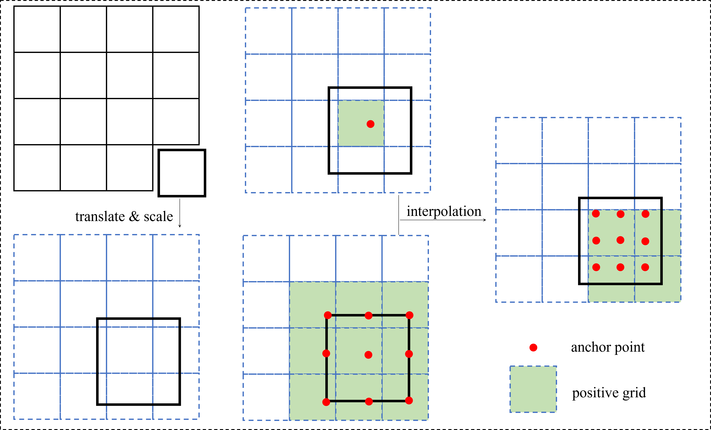

# <div align="center">Classification and Detection Fusion Model For Pavement Inspection</div>

# Demo


# Introduction

Here, we provide a PyTorch implementation of our series of work on automatic crack detection. The code is based on [YOLOv5](https://github.com/ultralytics/yolov5) and the main contributions are as follows:

 - Contribution 1: [A Grid-based Classification and Box-based Detection Fusion Model for Asphalt Pavement Crack](https://onlinelibrary.wiley.com/doi/abs/10.1111/mice.12962).

 - Contribution 2: Advanced label assignment for grid-classification task.

 - Contribution 3: We employ Vision Transformer as the backbone of our model.
 - Contribution 4: Self-supervised learning(e.g. [SAIM](https://github.com/qiy20/SAIM)) is applied to improve the performance of our model. 

# Main Results
## Train on Crack-20K
For convnets, we employ an SGD optimizer for 300 epochs using a cosine decay learning rate scheduler and we close mosaic/mixup/scale augmentation at last 50 epochs.

For ViT, we employ an AdamW optimizer for 180 epochs using a cosine decay learning rate scheduler and we close mosaic/mixup/scale augmentation at last 30 epochs.

|           | map_50 | map_50:95 | map_grid | params(10e6) | flops(GFLOPs) | speed(ms) | thresh      | hyp  |
| --------- | ------ | --------- | -------- | ------------ | ------------- | --------- | ----------- | ---- |
| yolov5n   | 0.698  | 0.415     | 0.911    | 2.38         | 5.91          |           | 0.161/0.564 | low  |
| yolov5s   | 0.717  | 0.430     | 0.917    | 9.49         | 22.46         |           | 0.148/0.554 | high |
| yolov5m   | 0.732  | 0.459     | 0.922    | 26           | 65.43         |           | 0.182/0.575 | high |
| yolov5l   | 0.732  | 0.468     | 0.923    | 55.9         | 143.5         |           | 0.174/0.576 | high |
| yolov5x   | 0.734  | 0.469     | 0.925    | 101          | 267.2         |           | 0.182/0.564 | high |
| vit-tiny  | 0.725  | 0.457     | 0.922    | 9.15         | 31.16         |           | 0.215/0.494 | vit  |
| vit-small |        |           |          | 35.98        | 124.4         |           |             | vit  |
| vit-med   |        |           |          | 63.70        | 221           |           |             | vit  |
| vit-base  | 0.739  | 0.472     | 0.931    | 142.8        | 496.9         |           | 0.214/0.509 | vit  |
## Train on Crack-50K
|           | map_50 | map_50:95 | map_grid | params(10e6) | flops(GFLOPs) | speed(ms) | thresh | hyp  |
| --------- | ------ | --------- | -------- | ------------ | ------------- | --------- | ------ | ---- |
| yolov5n   |        |           |          |              |               |           |        |      |
| yolov5s   |        |           |          |              |               |           |        |      |
| yolov5m   |        |           |          |              |               |           |        |      |
| yolov5l   |        |           |          |              |               |           |        |      |
| yolov5x   |        |           |          |              |               |           |        |      |
| vit-tiny  |        |           |          |              |               |           |        |      |
| vit-small |        |           |          |              |               |           |        |      |
| vit-med   |        |           |          |              |               |           |        |      |
| vit-base  |        |           |          |              |               |           |        |      |
# Getting Started
## Train Classification and Detection Fusion Model
The main code is in the [patch_classify](./patch_classify) and [utils/patch_classify](./utils/patch_classify) folders. The training process is as follows:
### Install
```bash
pip install -r requirements.txt  # install
```
### Train
```bash
python -m torch.distributed.run --nproc_per_node 3 patch_classify/train.py 
        --batch 192 
        --data data/crack_box_grid.yaml 
        --cfg models/patch_classify/$MODEL_CFG
        --weights $PRETRAIN_WEIGHTS
        --hyp data/hyps/$HYPERPARAMETER
        --cos-lr
        --epochs $EPOCHS
        --close-mosaic $CLOSE_MOSAIC_EPOCH
        --cache
```
### Valadation
```bash
python patch_classify/val.py 
       --weights runs_pc/train/exp/weights/best.pt
       --data data/crack_box_grid.yaml
       --img 640
       --half
```
### Export
```bash
python patch_classify/export.py 
        --weights runs_pc/train/exp/weights/best.pt
        --data data/crack_box_grid.yaml
        --dynamic
        --include onnx
        --simplify
```
### Detect
```bash
python patch_classify/detect.py 
        --weights runs_pc/train/exp/weights/best.pt
        --source data/detect.txt
```
## Pretrain on Unlabeled Data
Please refer to [SAIM](https://github.com/qiy20/SAIM).

