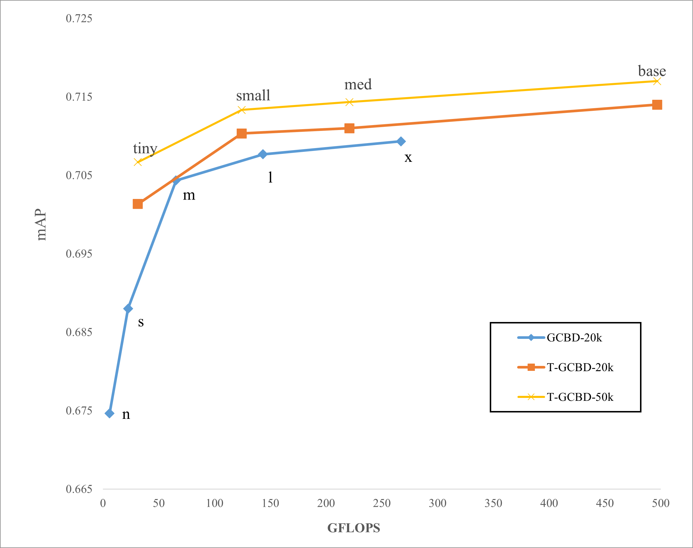

# Classification and Detection Fusion Model For Pavement Inspection

[English](README.md)｜[简体中文](README.zh-CN.md)

<div align="center">
  
</div>

## Introduction

This repository contains a PyTorch implementation of our series of work on automatic crack detection, based on [YOLOv5](https://github.com/ultralytics/yolov5). Our contributions include:

- **Contribution 1**: We propose a grid-based classification and box-based detection fusion model for asphalt pavement crack detection. See [our paper](https://onlinelibrary.wiley.com/doi/abs/10.1111/mice.12962) for details.
<div align="center">
    
</div>

- **Contribution 2**: We suggest the ARS post-processing method to eliminate redundant detection bounding boxes.
<div align="center">
    
</div>

- **Contribution 3**: We develop an advanced label assignment method for the grid-classification task, which allows us to use data augmentation freely.
<div align="center">
    
</div>

- **Contribution 4**: We employ a Vision Transformer as the backbone of our model, which enables us to leverage the benefits of big data.
<div align="center">
    
</div>

- **Contribution 5**: We apply self-supervised learning (e.g., [SAIM](https://github.com/qiy20/SAIM)) to improve the performance of our model. 

## Main Results

We trained our models on the Crack-20K and Crack-50K datasets, and evaluated their performance using several metrics. Here are the main results:
<div align="center">
    
</div>

### Train on Crack-20K

For convnets, we employed an SGD optimizer for 300 epochs using a cosine decay learning rate scheduler, and we disabled mosaic/mixup/scale augmentation in the last 50 epochs. 

For ViT, we used an AdamW optimizer for 180 epochs using a cosine decay learning rate scheduler, and we disabled mosaic/mixup/scale augmentation in the last 30 epochs.

| Model       | mAP@0.5 | mAP@0.5:0.95 | mAP-grid | Params (10e6) | FLOPs (GFLOPs) | Inference speed (ms) | Confidence threshold | Hyperparameters | Experiment index |
|-------------|---------|--------------|----------|---------------|----------------|----------------------|----------------------|-----------------|------------------|
| GCBD-n      | 0.698   | 0.415        | 0.911    | 2.38          | 5.91           |                      | 0.161/0.564          | low             | 39               |
| GCBD-s      | 0.717   | 0.430        | 0.917    | 9.49          | 22.46          |                      | 0.148/0.554          | high            | 40               |
| GCBD-m      | 0.732   | 0.459        | 0.922    | 9.49          | 22.46          |                      | 0.182/0.575          | high            | 41               |
| GCBD-l      | 0.732   | 0.468        | 0.923    | 55.9          | 143.5          |                      | 0.174/0.576          | high            | 42               |
| GCBD-x      | 0.734   | 0.469        | 0.925    | 101           | 267.2          |                      | 0.182/0.564          | high            | 43               |
| T-GCBD-tiny | 0.725  | 0.457     | 0.922    | 9.15         | 31.16         |           | 0.215/0.494 | vit  | 74        |
| T-GCBD-small   | 0.735  | 0.471     | 0.928    | 35.98        | 124.4         |           | 0.221/0.514 | vit  | 75        |
| T-GCBD-med     | 0.733  | 0.471     | 0.929    | 63.70        | 221           |           | 0.201/0.497 | vit  | 76        |
| T-GCBD-base    | 0.739  | 0.472     | 0.931    | 142.8        | 496.9         |           | 0.214/0.509 | vit  | 73        |
## Train on Crack-50K

The training setup on Crack-50K is the same as Crack-20K, except that all models were trained for 180 epochs.

| Model       | mAP@0.5 | mAP@0.5:0.95 | mAP-grid | Params (10e6) | FLOPs (GFLOPs) | Inference speed (ms) | Confidence threshold | Hyperparameters | Experiment index |
| --------- | ------ | --------- | -------- | ------------ | ------------- | --------- | ----------- | ---- | --------- |
| GCBD-n   | 0.689  | 0.415     | 0.906    | 2.38         | 5.91          |           | 0.039/0.391 | low  | 79        |
| GCBD-s   | 0.711  | 0.433     | 0.912    | 9.49         | 22.46         |           | 0.053/0.415 | high | 81        |
| GCBD-m   | 0.736  | 0.46      | 0.922    | 9.49         | 22.46         |           | 0.058/0.412 | high | 82        |
| GCBD-l   | 0.74   | 0.464     | 0.924    | 55.9         | 143.5         |           | 0.059/0.408 | high | 83        |
| GCBD-x   | 0.744  | 0.47      | 0.925    | 101          | 267.2         |           | 0.059/0.447 | high | 84        |
| T-GCBD-tiny  | 0.73   | 0.467     | 0.923    | 9.15         | 31.16         |           | 0.164/0.543 | vit  | 85        |
| T-GCBD-small | 0.737  | 0.476     | 0.927    | 35.98        | 124.4         |           | 0.213/0.578 | vit  | 86        |
| T-GCBD-med   | 0.737  | 0.478     | 0.928    | 63.70        | 221           |           | 0.208/0.606 | vit  | 87        |
| T-GCBD-base  | 0.738  | 0.481     | 0.929    | 142.8        | 496.9         |           | 0.223/0.597 | vit  | 88        |

## Getting Started
### Train Classification and Detection Fusion Model
The main code is located in the [patch_classify](./patch_classify) and [utils/patch_classify](./utils/patch_classify) folders. The training process is as follows:
#### Install
```bash
pip install -r requirements.txt  # install
```
#### Train
```bash
python -m torch.distributed.run --nproc_per_node 3 patch_classify/train.py 
        --batch 192 
        --data data/crack_box_grid.yaml 
        --cfg models/patch_classify/$MODEL_CFG
        --weights $PRETRAIN_WEIGHTS
        --hyp data/hyps/$HYPERPARAMETER
        --cos-lr
        --epochs $EPOCHS
        --close-mosaic $CLOSE_MOSAIC_EPOCH
        --cache
```
#### Valadation
```bash
python patch_classify/val.py 
       --weights runs_pc/train/exp/weights/best.pt
       --data data/crack_box_grid.yaml
       --img 640
       --half
```
#### Export
```bash
python patch_classify/export.py 
        --weights runs_pc/train/exp/weights/best.pt
        --data data/crack_box_grid.yaml
        --dynamic
        --include onnx
        --simplify
```
#### Detect
```bash
python patch_classify/detect.py 
        --weights runs_pc/train/exp/weights/best.pt
        --source data/detect.txt
```
### Pretrain on Unlabeled Data
Please refer to [SAIM](https://github.com/qiy20/SAIM).

## Citation

```bibtex
@article{li2023grid,
  title={A grid-based classification and box-based detection fusion model for asphalt pavement crack},
  author={Li, Bao-Luo and Qi, Yu and Fan, Jian-Sheng and Liu, Yu-Fei and Liu, Cheng},
  journal={Computer-Aided Civil and Infrastructure Engineering},
  volume={38},
  number={16},
  pages={2279--2299},
  year={2023},
  publisher={Wiley Online Library}
}
```

