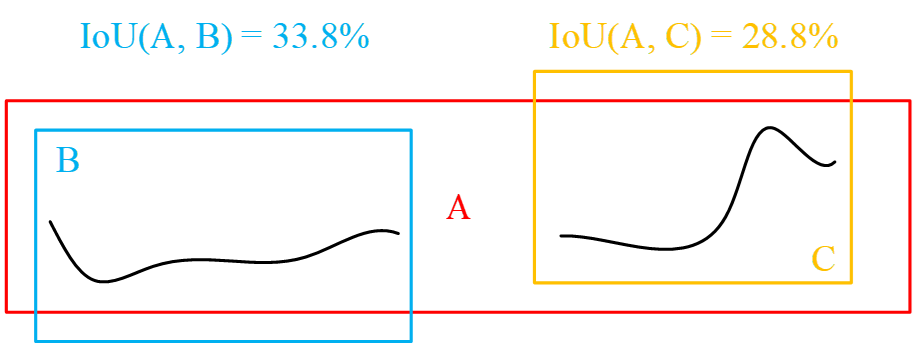
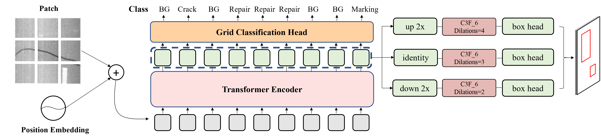
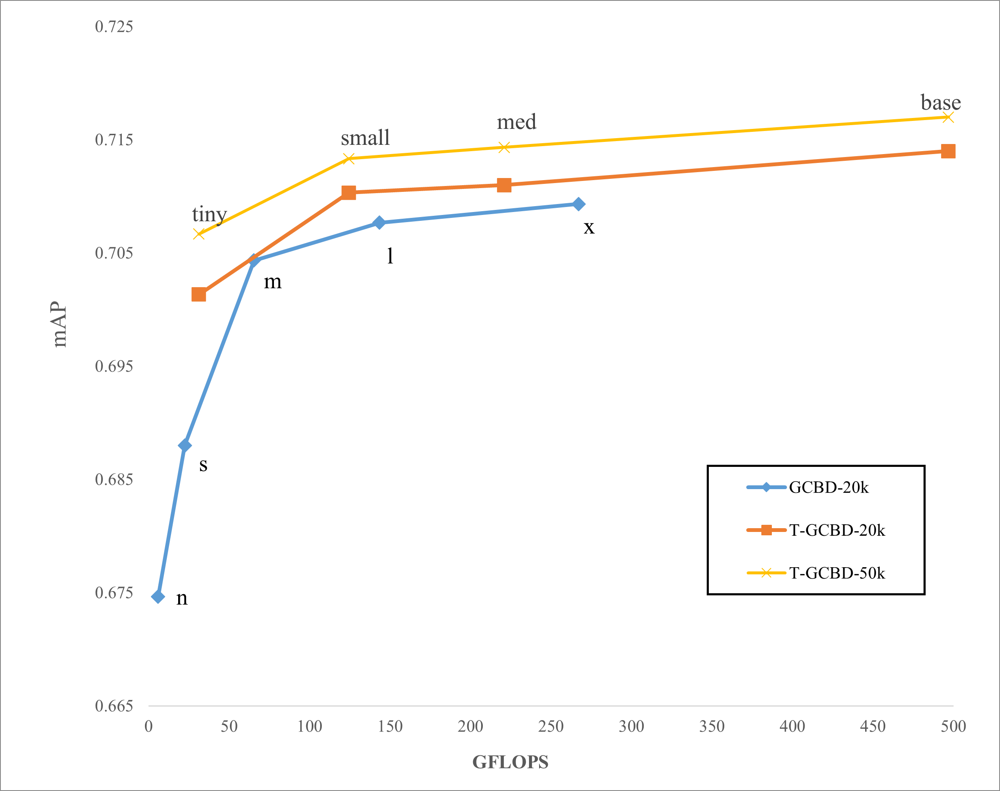

# 路面巡检分类与检测融合模型

<div align="center">
  
</div>

[English](README.md)｜[简体中文](README.zh-CN.md)

## 引言

本仓库提供了我们基于 [YOLOv5](https://github.com/ultralytics/yolov5) 的自动裂缝检测系列工作的 PyTorch 实现。我们的主要贡献包括：

- **贡献 1**：提出了一种基于网格分类与框检测融合的沥青路面裂缝检测模型，详见[论文](https://onlinelibrary.wiley.com/doi/abs/10.1111/mice.12962)。
<div align="center">
    
</div>

- **贡献 2**：提出 ARS 后处理方法来消除冗余的检测框。
<div align="center">
    
</div>

- **贡献 3**：为网格分类任务设计了先进的标签分配策略，使我们能够灵活地使用数据增强。
<div align="center">
    
</div>

- **贡献 4**：引入 Vision Transformer 作为骨干网络，从而充分利用大规模数据带来的优势。
<div align="center">
    
</div>

- **贡献 5**：结合自监督学习方法（例如 [SAIM](https://github.com/qiy20/SAIM)）进一步提升模型性能。

## 主要结果

我们在 Crack-20K 和 Crack-50K 数据集上训练并评估了模型的性能，核心结果如下：
<div align="center">
    
</div>

### Crack-20K 训练结果

- 卷积网络：使用 SGD 优化器训练 300 个 epoch，采用余弦衰减学习率调度器，并在最后 50 个 epoch 关闭 mosaic/mixup/scale 数据增强。
- ViT：使用 AdamW 优化器训练 180 个 epoch，采用余弦衰减学习率调度器，并在最后 30 个 epoch 关闭 mosaic/mixup/scale 数据增强。

| 模型 | mAP@0.5 | mAP@0.5:0.95 | mAP-grid | 参数量 (10e6) | FLOPs (GFLOPs) | 推理速度 (ms) | 置信度阈值 | 超参数 | 实验编号 |
|-------------|---------|--------------|----------|---------------|----------------|----------------------|---------------------|-----------------|------------------|
| GCBD-n      | 0.698   | 0.415        | 0.911    | 2.38          | 5.91           |                      | 0.161/0.564 | low             | 39               |
| GCBD-s      | 0.717   | 0.430        | 0.917    | 9.49          | 22.46          |                      | 0.148/0.554 | high            | 40               |
| GCBD-m      | 0.732   | 0.459        | 0.922    | 9.49          | 22.46          |                      | 0.182/0.575 | high            | 41               |
| GCBD-l      | 0.732   | 0.468        | 0.923    | 55.9          | 143.5          |                      | 0.174/0.576 | high            | 42               |
| GCBD-x      | 0.734   | 0.469        | 0.925    | 101           | 267.2          |                      | 0.182/0.564 | high            | 43               |
| T-GCBD-tiny | 0.725  | 0.457     | 0.922    | 9.15         | 31.16         |           | 0.215/0.494 | vit  | 74        |
| T-GCBD-small   | 0.735  | 0.471     | 0.928    | 35.98        | 124.4         |           | 0.221/0.514 | vit  | 75        |
| T-GCBD-med     | 0.733  | 0.471     | 0.929    | 63.70        | 221           |           | 0.201/0.497 | vit  | 76        |
| T-GCBD-base    | 0.739  | 0.472     | 0.931    | 142.8        | 496.9         |           | 0.214/0.509 | vit  | 73        |

### Crack-50K 训练结果

训练策略与 Crack-20K 相同，但所有模型仅训练 180 个 epoch。

| 模型 | mAP@0.5 | mAP@0.5:0.95 | mAP-grid | 参数量 (10e6) | FLOPs (GFLOPs) | 推理速度 (ms) | 置信度阈值 | 超参数 | 实验编号 |
| --------- | ------ | --------- | -------- | ------------ | ------------- | --------- | ----------- | ---- | --------- |
| GCBD-n   | 0.689  | 0.415     | 0.906    | 2.38         | 5.91          |           | 0.039/0.391 | low  | 79        |
| GCBD-s   | 0.711  | 0.433     | 0.912    | 9.49         | 22.46         |           | 0.053/0.415 | high | 81        |
| GCBD-m   | 0.736  | 0.46      | 0.922    | 9.49         | 22.46         |           | 0.058/0.412 | high | 82        |
| GCBD-l   | 0.74   | 0.464     | 0.924    | 55.9         | 143.5         |           | 0.059/0.408 | high | 83        |
| GCBD-x   | 0.744  | 0.47      | 0.925    | 101          | 267.2         |           | 0.059/0.447 | high | 84        |
| T-GCBD-tiny  | 0.73   | 0.467     | 0.923    | 9.15         | 31.16         |           | 0.164/0.543 | vit  | 85        |
| T-GCBD-small | 0.737  | 0.476     | 0.927    | 35.98        | 124.4         |           | 0.213/0.578 | vit  | 86        |
| T-GCBD-med   | 0.737  | 0.478     | 0.928    | 63.70        | 221           |           | 0.208/0.606 | vit  | 87        |
| T-GCBD-base  | 0.738  | 0.481     | 0.929    | 142.8        | 496.9         |           | 0.223/0.597 | vit  | 88        |

## 快速开始

### 训练分类与检测融合模型

主要代码位于 [patch_classify](./patch_classify) 和 [utils/patch_classify](./utils/patch_classify) 目录，训练流程如下：

#### 环境安装
```bash
pip install -r requirements.txt  # 安装依赖
```

#### 开始训练
```bash
python -m torch.distributed.run --nproc_per_node 3 patch_classify/train.py \
        --batch 192 \
        --data data/crack_box_grid.yaml \
        --cfg models/patch_classify/$MODEL_CFG \
        --weights $PRETRAIN_WEIGHTS \
        --hyp data/hyps/$HYPERPARAMETER \
        --cos-lr \
        --epochs $EPOCHS \
        --close-mosaic $CLOSE_MOSAIC_EPOCH \
        --cache
```

#### 验证
```bash
python patch_classify/val.py \
       --weights runs_pc/train/exp/weights/best.pt \
       --data data/crack_box_grid.yaml \
       --img 640 \
       --half
```

#### 导出
```bash
python patch_classify/export.py \
        --weights runs_pc/train/exp/weights/best.pt \
        --data data/crack_box_grid.yaml \
        --dynamic \
        --include onnx \
        --simplify
```

#### 检测
```bash
python patch_classify/detect.py \
        --weights runs_pc/train/exp/weights/best.pt \
        --source data/detect.txt
```

### 无标签数据预训练

请参考 [SAIM](https://github.com/qiy20/SAIM)。
